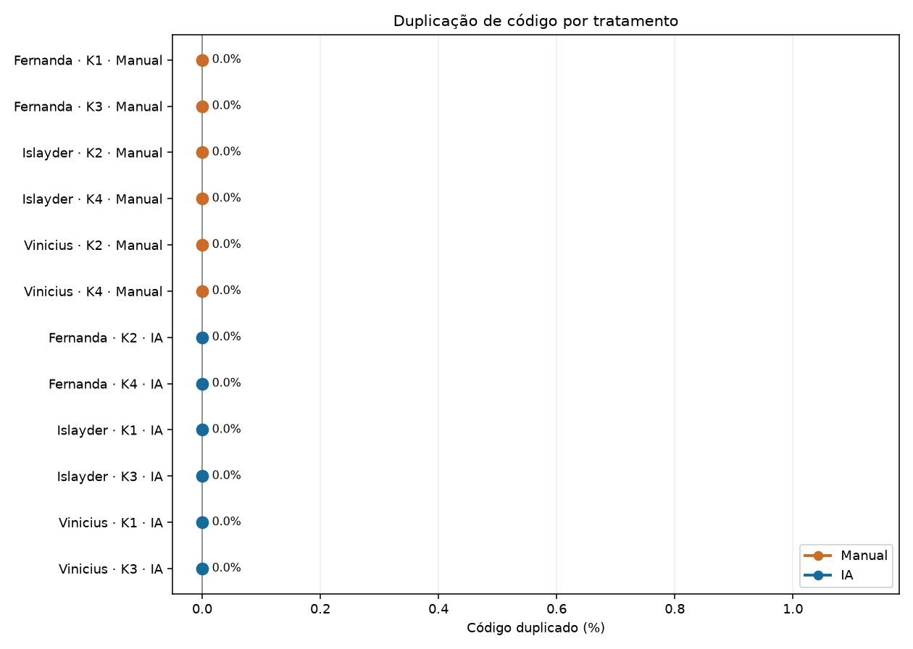

# Relatório final — Laboratório 02

## 1. Identificação

- Disciplina: Medição e Experimentação de Software.
- Repositório: `fesoaress/Laboratorio-Medicao-e-experimentacao`.
- Branch de entrega: `Laboratorio-2`.
- Participantes: Fernanda, Islayder e Vinicius.
- Data da consolidação: 23 de setembro de 2026.

## 2. Introdução

Este laboratório avaliou, em tarefas curtas de programação, diferenças entre o uso de assistente de inteligência artificial e a codificação manual. O protocolo combinou testes de aceitação, limite temporal, registro de ciclos e métricas estruturais. Os resultados são descritivos de uma amostra pequena e não sustentam, isoladamente, inferências causais ou generalizações para outros contextos.

## 3. Objetivo

O objetivo foi comparar os tratamentos **IA** e **Manual** quanto ao tempo até uma solução verde, aos defeitos evidenciados pelos testes de aceitação, à estrutura do código final e ao retrabalho observado ao longo dos ciclos.

## 4. Questões de Pesquisa

- **RQ1 — Tempo:** o uso de assistente de IA altera o tempo até a solução ficar verde?
- **RQ2 — Defeitos/testes:** o tratamento altera o resultado final dos testes de aceitação?
- **RQ3 — Estrutura:** o tratamento altera LOC, complexidade ciclomática ou duplicação do código produzido?
- **Inovação:** como os testes evoluem entre ciclos e quanto retrabalho ocorre até o estado verde?

## 5. Metodologia

Cada participante resolveu quatro katas, dois com IA e dois manualmente. O runner criou workspaces isolados, protegeu os testes fornecidos, executou `pytest`, persistiu um registro por ciclo e encerrou cada trial em `green` ou no limite de 35 minutos. Para RQ1, RQ2 e inovação foram selecionados 12 trials finais, seis por tratamento. Duas tentativas inválidas de Vinicius e os quatro cenários históricos `SIM-*` foram auditados e excluídos.

Os trials IA #21 e #25 de Islayder foram realizados com Gemini no celular, cronometrados durante a execução e informados pelo participante. Como não passaram pelo runner, seus campos efetivamente observados ficam no arquivo separado `participant_reported_trials.csv`; a análise não fabrica timestamp, snapshot ou identificador de runner. O total de testes foi validado diretamente nos testes de aceitação: 10 no Kata 1 e 9 no Kata 3.

Para RQ3 foram usados 12 arquivos `solucao.py` existentes, executáveis e mensuráveis. O coletor foi reexecutado sobre todos eles, e os resultados foram comparados aos registros consolidados. Registros com `source_kind=observed_simulated` não entram em nenhuma análise final. Os registros `agent_delegated_codex_work` de Fernanda foram mantidos por corresponderem aos trials finais documentados, não a fixtures simuladas.

## 6. Participantes

| Participante | Trials finais | IA | Manual |
|---|---:|---:|---:|
| Fernanda | 4 | 2 | 2 |
| Islayder | 4 | 2 | 2 |
| Vinicius | 4 | 2 | 2 |
| **Total** | **12** | **6** | **6** |

## 7. Katas

Os quatro katas são funções puras em Python, sem dependências de produção externas:

1. `kata1_normalizador_etiquetas`: normalização e validação de etiquetas — 10 testes;
2. `kata2_balanceamento_turnos`: balanceamento de turnos — 9 testes;
3. `kata3_compactador_sensor`: compactação de leituras de sensor — 9 testes;
4. `kata4_manutencao_preditiva`: priorização para manutenção preditiva — 7 testes.

Os gabaritos de referência foram verificados isoladamente: 10/10, 9/9, 9/9 e 7/7 testes passaram. Eles não foram disponibilizados nos workspaces dos participantes.

## 8. Desenho Experimental

O estudo adotou medidas repetidas: cada participante foi exposto aos dois tratamentos, sempre em katas diferentes. Cada trial iniciou a partir do stub do kata e terminou quando todos os testes passaram ou quando o time-box foi atingido. O tempo principal foi o tempo até `green`; os testes finais, ciclos e snapshots foram vinculados por participante, Issue, kata e tratamento.

| Participante | Issue | Kata | Tratamento | Tempo (s) | Testes | Ciclos | Status |
|---|---:|---|---|---:|---:|---:|---|
| Fernanda | #19 | Kata 2 | IA | 224,89 | 9/9 | 2 | green |
| Fernanda | #27 | Kata 1 | Manual | 63,20 | 10/10 | 2 | green |
| Fernanda | #29 | Kata 4 | IA | 74,02 | 7/7 | 2 | green |
| Fernanda | #28 | Kata 3 | Manual | 58,83 | 9/9 | 2 | green |
| Islayder | #21 | Kata 1 | IA | 75,00 | 10/10 | 1 | green |
| Islayder | #24 | Kata 2 | Manual | 127,17 | 9/9 | 1 | green |
| Islayder | #25 | Kata 3 | IA | 150,00 | 9/9 | 1 | green |
| Islayder | #26 | Kata 4 | Manual | 208,02 | 7/7 | 2 | green |
| Vinicius | #22 | Kata 1 | IA | 49,95 | 10/10 | 1 | green |
| Vinicius | #30 | Kata 2 | Manual | 365,99 | 9/9 | 1 | green |
| Vinicius | #31 | Kata 3 | IA | 324,52 | 9/9 | 1 | green |
| Vinicius | #32 | Kata 4 | Manual | 451,74 | 7/7 | 2 | green |

## 9. Contrabalanceamento

Islayder e Vinicius executaram a sequência Kata 1 IA, Kata 2 Manual, Kata 3 IA e Kata 4 Manual. Fernanda recebeu os tratamentos opostos e a ordem Kata 2 IA, Kata 1 Manual, Kata 4 IA e Kata 3 Manual. Assim, cada participante realizou dois trials por tratamento e cada kata apareceu nos dois tratamentos no conjunto, embora a alocação por kata seja 2:1 devido ao número ímpar de participantes.

## 10. Instrumentação

O módulo `lab02/trials` implementa preparação, execução, time-box de 2.100 segundos, persistência atômica, snapshots finais, proteção dos testes e registro de ciclos. `trials.csv` e `trial_cycles.csv` preservam as execuções instrumentadas. Os dois trials IA de Islayder observados fora do runner permanecem no sidecar de dados informados pelo participante. O coletor estrutural usa Radon 6.0.1 para LOC e complexidade e jscpd 5.2.0, com configuração versionada, para duplicação.

## 11. Métricas

- **Tempo até green:** segundos decorridos até todos os testes passarem; trials no time-box seriam censurados em 2.100 s.
- **Testes:** contagens absolutas passando, falhando e total, além da taxa final.
- **Ciclos:** quantidade de execuções dos testes e primeiro ciclo em que ocorreu `green`.
- **LOC:** linhas lógicas de código (`lloc`) de `solucao.py`.
- **Complexidade ciclomática:** média por função/método e máximo observado no arquivo.
- **Duplicação:** percentual, linhas e blocos duplicados.

Medianas, quartis e IQR usam a convenção de interpolação linear do Pandas. O teste de Wilcoxon foi aplicado às medianas individuais: para cada participante, a mediana dos dois tempos IA foi pareada à mediana dos dois tempos manuais.

## 12. RQ1 — Tempo

| Tratamento | n | Média (s) | Mediana (s) | Q1 (s) | Q3 (s) | IQR (s) | Green | Censurados |
|---|---:|---:|---:|---:|---:|---:|---:|---:|
| IA | 6 | 149,73 | 112,50 | 74,265 | 206,1675 | 131,9025 | 6 | 0 |
| Manual | 6 | 212,4917 | 167,595 | 79,1925 | 326,4975 | 247,305 | 6 | 0 |

As medianas por participante formaram três pares. O Wilcoxon resultou em **W = 2,0** e **p = 0,75**. Portanto, a amostra apresentou menor mediana e menor média no tratamento IA, mas não forneceu evidência estatística de diferença entre tratamentos. O pareamento é por participante e compara katas distintos, devendo ser interpretado com cautela.

No recorte de Islayder, IA teve 75 s e 150 s, com média e mediana de 112,5 s e IQR de 37,5 s. Manual teve 127,17 s e 208,02 s, com média e mediana de 167,595 s e IQR de 40,425 s.


## 13. RQ2 — Defeitos/Testes

| Tratamento | Trials | Green | Time-box | Testes passando | Falhando | Total | Taxa final mediana |
|---|---:|---:|---:|---:|---:|---:|---:|
| IA | 6 | 6 | 0 | 54 | 0 | 54 | 100% |
| Manual | 6 | 6 | 0 | 51 | 0 | 51 | 100% |

Todos os 105 testes finais passaram. Em Islayder, os resultados foram #21 10/10, #24 9/9, #25 9/9 e #26 7/7, todos `green`. Assim, **RQ2 não mostrou diferença no resultado final de aceitação**: ambos os tratamentos alcançaram 100% e zero falhas finais. A evolução intermediária, entretanto, diferiu e é tratada na seção de inovação.


## 14. RQ3 — Estrutura do Código

| Tratamento | Métrica | n | Mediana | Q1 | Q3 | IQR |
|---|---|---:|---:|---:|---:|---:|
| IA | LOC lógico | 6 | 15,0 | 14,25 | 15,75 | 1,50 |
| Manual | LOC lógico | 6 | 11,0 | 10,25 | 12,50 | 2,25 |
| IA | CC média | 6 | 3,5 | 3,00 | 4,75 | 1,75 |
| Manual | CC média | 6 | 4,0 | 3,25 | 4,00 | 0,75 |
| IA | Duplicação | 6 | 0% | 0% | 0% | 0% |
| Manual | Duplicação | 6 | 0% | 0% | 0% | 0% |

Os 12 artefatos tiveram métricas completas e reproduzíveis. No conjunto, IA apresentou maior mediana de LOC, menor mediana de complexidade média e a mesma duplicação mediana do tratamento Manual. Com seis arquivos por grupo e katas heterogêneos, esses resultados são descritivos e não demonstram efeito causal.

Para Islayder, #21 apresentou 15 LOC, CC média 4,0, CC máxima 4, duplicação 0%, zero linhas/blocos duplicados e uma função; #25 apresentou 27 LOC, CC média 2,6667, CC máxima 4, duplicação 0%, zero linhas/blocos duplicados e três funções. Os testes desses artefatos passaram em 10/10 e 9/9, respectivamente.

Os snapshots originais apontados pelos trials finais de Fernanda não foram versionados. Seus quatro artefatos estruturais foram reconstruídos a partir de códigos preparatórios já presentes no repositório, passam nos testes e reproduzem as métricas consolidadas. Essa reconstrução preserva mensurabilidade, mas limita a equivalência de proveniência com os snapshots originais.




## 15. Inovação — Evolução por Ciclos

| Tratamento | Trials | Ciclos — mediana | Intervalo de ciclos | Taxa mediana no 1º ciclo | Taxa mediana final |
|---|---:|---:|---:|---:|---:|
| IA | 6 | 1 | 1–2 | 100% | 100% |
| Manual | 6 | 2 | 1–2 | 14,285% | 100% |

A inovação do protocolo foi preservar o desempenho a cada execução de testes, permitindo observar progresso e retrabalho, e não apenas o estado final. A mediana de IA atingiu o conjunto completo no primeiro ciclo; a mediana Manual precisou de dois ciclos. Em Islayder, #21, #24 e #25 ficaram verdes em um ciclo, e #26 evoluiu de 2/7 para 7/7 no segundo ciclo. O resultado sugere menor retrabalho mediano com IA nesta amostra, sem estabelecer causalidade.


## 16. Dashboard

O dashboard consolida RQ1, RQ2, RQ3 e inovação a partir dos CSVs finais, com 12 trials para tempo/testes/ciclos e 12 artefatos para estrutura. Ele valida a ausência de registros simulados na RQ3 e a presença dos três participantes antes de gerar a figura.

Para reproduzi-lo na raiz do repositório:

```powershell
.\.venv\Scripts\python.exe -m lab02.dashboard.build_dashboard
```


## 17. Discussão

Os resultados finais convergem em três pontos. Primeiro, IA teve tempos centrais menores, mas com alta dispersão e sem diferença estatisticamente detectável no Wilcoxon. Segundo, os dois tratamentos terminaram com todos os testes passando; a distinção mais visível ocorreu na trajetória, pois IA apresentou menos ciclos e maior taxa no primeiro ciclo. Terceiro, os códigos IA foram mais longos na mediana, ligeiramente menos complexos pela média ciclomática e igualmente sem duplicação detectada. Essas dimensões não devem ser combinadas em um único julgamento de qualidade.

O relatório mantém separados: tentativas finais, tentativas inválidas, fixtures históricas simuladas e observações informadas fora do runner. Essa separação evita aumentar artificialmente a amostra e permite rastrear a origem de cada resultado.

## 18. Ameaças à Validade

- **Amostra:** três participantes e seis observações por tratamento limitam poder estatístico e generalização.
- **Heterogeneidade dos katas:** cada tratamento usa tarefas distintas para cada participante; diferenças de dificuldade podem se confundir com o tratamento.
- **Experiência e aprendizado:** familiaridade com Python, assistentes e katas pode afetar tempo, estratégia e ciclos; a ordem não elimina completamente o efeito de aprendizado.
- **Ferramenta de IA:** versões, interfaces e qualidade das respostas podem variar. Islayder usou Gemini no celular, enquanto dois registros de Fernanda têm proveniência `agent_delegated_codex_work`.
- **Ambiente e instrumentação:** os trials IA de Islayder foram cronometrados fora do runner e informados pelo participante; não possuem os mesmos timestamps e snapshots automáticos dos demais trials.
- **Proveniência estrutural:** os artefatos RQ3 de Fernanda são reconstruções testáveis de código já versionado, não os snapshots originais do runner.
- **Piloto:** o protocolo prescreve piloto temporal externo, mas não há evidência versionada de sua execução; isso limita a verificação independente da calibração dos katas.
- **Métricas:** LOC, complexidade e duplicação capturam apenas aspectos estruturais e não equivalem, isoladamente, a manutenibilidade ou qualidade global.

## 19. Conclusão

- **RQ1:** IA apresentou menor tempo médio e mediano, porém o Wilcoxon com três pares resultou em p = 0,75; não há evidência suficiente de diferença entre tratamentos.
- **RQ2:** IA e Manual alcançaram todos os testes finais, com 54/54 e 51/51, respectivamente; não houve diferença no desfecho final de aceitação.
- **RQ3:** IA teve maior LOC mediana (15 contra 11), menor CC média mediana (3,5 contra 4,0) e a mesma duplicação mediana (0%); o resultado é descritivo.
- **Inovação:** IA apresentou mediana de um ciclo e 100% dos testes no primeiro ciclo, enquanto Manual apresentou mediana de dois ciclos e 14,285% no primeiro; ambos terminaram em 100%.

O Lab02 está consolidado com 12 trials finais, 12 artefatos estruturais, análises regeneráveis, gráficos e dashboard coerentes. As conclusões permanecem proporcionais à amostra e às limitações documentadas.

## 20. Referências existentes

- [Protocolo e instrumentação dos trials](../../lab02/trials/README.md)
- [Definições e execução das análises](../../lab02/analysis/README.md)
- [Coletor e definições das métricas estruturais](../../lab02/metrics/README.md)
- [Relatório consolidado da Sprint 03](../sprints/s03/relatorio_s03.md)
- [Registro individual de Fernanda](../sprints/lab02_s02/fernanda.md)
- [Registro individual de Islayder](../sprints/lab02_s02/islayder.md)
- [Registro individual de Vinicius](../sprints/lab02_s02/vinicius.md)
