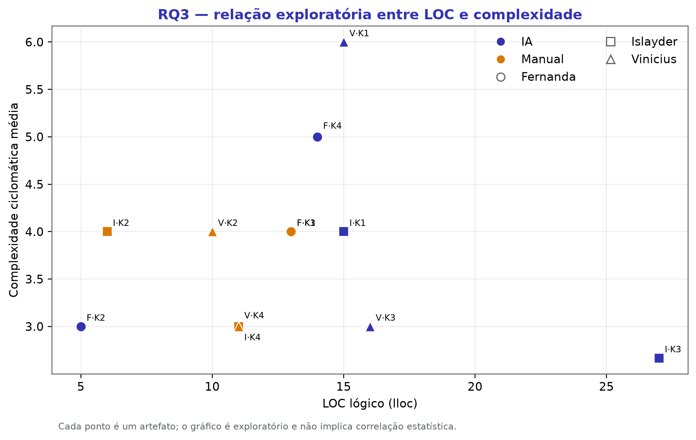

# Laboratório 02 — Assistentes de IA vs. Codificação Manual

## 1. Capa

**Pontifícia Universidade Católica de Minas Gerais**

**Engenharia de Software**

**Medição e Experimentação de Software**

**LABORATÓRIO 02**

**Assistentes de IA vs. Codificação Manual**

**Participantes:**

Fernanda Soares

Islayder Jackson

Vinicius Gomes

**Professor:** Danilo Maia

**Data:** Setembro de 2026

## 2. Sumário

1. Capa
2. Sumário
3. Introdução
4. Objetivos
5. Questões de pesquisa
6. Metodologia
7. Participantes
8. Katas
9. Desenho experimental
10. Contrabalanceamento
11. Instrumentação
12. Métricas
13. RQ1 — Tempo até green
14. RQ2 — Resultado dos testes de aceitação
15. RQ3 — Estrutura do código
16. Inovação — Evolução por ciclos
17. Dashboard
18. Discussão
19. Ameaças à validade
20. Conclusão
21. Referências

## 3. Introdução

Este laboratório avaliou diferenças entre o uso de assistentes de inteligência artificial e a codificação manual em tarefas curtas de programação. O protocolo combinou testes de aceitação, limite temporal, registro de ciclos e métricas estruturais sobre o código final. Os resultados descrevem uma amostra pequena e não sustentam, isoladamente, inferências causais ou generalizações para outros contextos.

A análise final preserva a separação entre execuções instrumentadas, observações informadas pelo participante e artefatos estruturais mensuráveis. Tentativas inválidas e cenários históricos `SIM-*` foram excluídos do conjunto analítico.

## 4. Objetivos

O objetivo geral foi comparar os tratamentos **IA** e **Manual** quanto ao tempo até uma solução verde, ao resultado dos testes de aceitação, à estrutura do código final e ao retrabalho observado ao longo dos ciclos.

Como objetivos específicos, buscou-se:

- mensurar tempo, testes e ciclos de cada trial final;
- comparar medidas centrais e dispersão entre tratamentos;
- coletar LOC, complexidade ciclomática e duplicação dos artefatos finais;
- registrar a evolução dos testes sem inventar ciclos ausentes;
- produzir resultados rastreáveis e regeneráveis a partir dos arquivos versionados.

## 5. Questões de pesquisa

- **RQ1 — Tempo:** o uso de assistente de IA altera o tempo até a solução ficar verde?
- **RQ2 — Defeitos/testes:** o tratamento altera o resultado final dos testes de aceitação?
- **RQ3 — Estrutura:** o tratamento altera LOC, complexidade ciclomática ou duplicação do código produzido?
- **Inovação:** como os testes evoluem entre ciclos e quanto retrabalho ocorre até o estado verde?

## 6. Metodologia

Cada participante resolveu quatro katas: dois com IA e dois manualmente. O runner criou workspaces isolados, protegeu os testes fornecidos, executou `pytest`, persistiu um registro por ciclo e encerrou cada trial em `green` ou no limite de 35 minutos. Para RQ1, RQ2 e inovação foram selecionados 12 trials finais, seis por tratamento. Duas tentativas inválidas de Vinicius e quatro cenários históricos `SIM-*` foram auditados e excluídos.

Os trials IA #21 e #25 de Islayder foram realizados com Gemini no celular, cronometrados durante a execução e informados pelo participante. Como não passaram pelo runner, seus campos observados ficam no arquivo separado `participant_reported_trials.csv`; a análise não fabrica timestamp, snapshot ou identificador de runner. O total de testes foi conferido diretamente nos testes de aceitação: 10 no Kata 1 e 9 no Kata 3.

Para RQ3 foram usados 12 arquivos `solucao.py` existentes, executáveis e mensuráveis. O coletor foi reexecutado sobre todos eles, e os resultados foram comparados aos registros consolidados. Nenhum registro `SIM-*` integra a análise final. Os registros `agent_delegated_codex_work` de Fernanda foram mantidos por corresponderem aos trials finais documentados, e não a fixtures simuladas.

## 7. Participantes

**Tabela 1 — Distribuição dos trials finais por participante e tratamento.**

| Participante | Trials finais | IA | Manual |
|---|---:|---:|---:|
| Fernanda Soares | 4 | 2 | 2 |
| Islayder Jackson | 4 | 2 | 2 |
| Vinicius Gomes | 4 | 2 | 2 |
| **Total** | **12** | **6** | **6** |

Os três participantes contribuíram igualmente para a amostra. Portanto, nenhum participante domina numericamente um dos tratamentos.

## 8. Katas

Os quatro katas são funções puras em Python, sem dependências externas de produção.

**Tabela 2 — Katas e quantidade real de testes de aceitação.**

| Kata | Identificador | Objetivo | Testes |
|---:|---|---|---:|
| 1 | `kata1_normalizador_etiquetas` | Normalizar e validar etiquetas | 10 |
| 2 | `kata2_balanceamento_turnos` | Balancear turnos | 9 |
| 3 | `kata3_compactador_sensor` | Compactar leituras de sensor | 9 |
| 4 | `kata4_manutencao_preditiva` | Priorizar manutenção preditiva | 7 |

Os gabaritos de referência foram verificados isoladamente: 10/10, 9/9, 9/9 e 7/7 testes passaram. Eles não foram disponibilizados nos workspaces dos participantes.

## 9. Desenho experimental

O estudo adotou medidas repetidas: cada participante foi exposto aos dois tratamentos, sempre em katas diferentes. Cada trial iniciou a partir do stub do kata e terminou quando todos os testes passaram ou quando o time-box foi atingido. O desfecho principal foi o tempo até `green`; testes finais, ciclos e artefatos foram vinculados por participante, Issue, kata e tratamento.

**Tabela 3 — Conjunto final dos 12 trials analisados.**

| Participante | Issue | Kata | Tratamento | Tempo (s) | Testes | Ciclos | Status |
|---|---:|---|---|---:|---:|---:|---|
| Fernanda | #19 | Kata 2 | IA | 224,89 | 9/9 | 2 | green |
| Fernanda | #27 | Kata 1 | Manual | 63,20 | 10/10 | 2 | green |
| Fernanda | #29 | Kata 4 | IA | 74,02 | 7/7 | 2 | green |
| Fernanda | #28 | Kata 3 | Manual | 58,83 | 9/9 | 2 | green |
| Islayder | #21 | Kata 1 | IA | 75,00 | 10/10 | 1 | green |
| Islayder | #24 | Kata 2 | Manual | 127,17 | 9/9 | 1 | green |
| Islayder | #25 | Kata 3 | IA | 150,00 | 9/9 | 1 | green |
| Islayder | #26 | Kata 4 | Manual | 208,02 | 7/7 | 2 | green |
| Vinicius | #22 | Kata 1 | IA | 49,95 | 10/10 | 1 | green |
| Vinicius | #30 | Kata 2 | Manual | 365,99 | 9/9 | 1 | green |
| Vinicius | #31 | Kata 3 | IA | 324,52 | 9/9 | 1 | green |
| Vinicius | #32 | Kata 4 | Manual | 451,74 | 7/7 | 2 | green |

## 10. Contrabalanceamento

Islayder e Vinicius executaram a sequência Kata 1 IA, Kata 2 Manual, Kata 3 IA e Kata 4 Manual. Fernanda recebeu os tratamentos opostos e a ordem Kata 2 IA, Kata 1 Manual, Kata 4 IA e Kata 3 Manual.

**Tabela 4 — Alocação dos tratamentos por participante e kata.**

| Participante | Kata 1 | Kata 2 | Kata 3 | Kata 4 |
|---|---|---|---|---|
| Fernanda | Manual | IA | Manual | IA |
| Islayder | IA | Manual | IA | Manual |
| Vinicius | IA | Manual | IA | Manual |

Cada participante realizou dois trials por tratamento e cada kata apareceu nos dois tratamentos no conjunto. A alocação por kata é 2:1 devido ao número ímpar de participantes.

## 11. Instrumentação

O módulo `lab02/trials` implementa preparação, execução, time-box de 2.100 segundos, persistência atômica, snapshots finais, proteção dos testes e registro de ciclos. `trials.csv` e `trial_cycles.csv` preservam as execuções instrumentadas. Os dois trials IA de Islayder observados fora do runner permanecem no sidecar de dados informados pelo participante.

O coletor estrutural usa Radon 6.0.1 para LOC e complexidade e jscpd 5.2.0, com configuração versionada, para duplicação. Os scripts de análise geram tabelas intermediárias, figuras e dashboard a partir das fontes finais, permitindo repetição do processo.

## 12. Métricas

**Tabela 5 — Definições operacionais das métricas.**

| Dimensão | Métrica | Definição operacional |
|---|---|---|
| RQ1 | Tempo até green | Segundos decorridos até todos os testes passarem; trials no limite seriam censurados em 2.100 s |
| RQ2 | Testes | Contagens absolutas passando, falhando e total, além da taxa final |
| Inovação | Ciclos | Número de execuções dos testes e primeiro ciclo em que ocorreu `green` |
| RQ3 | LOC | Linhas lógicas de código (`lloc`) de `solucao.py` |
| RQ3 | Complexidade | Média ciclomática por função/método e máximo do arquivo |
| RQ3 | Duplicação | Percentual, linhas e blocos duplicados |

Medianas, quartis e IQR usam a interpolação linear do Pandas. O teste de Wilcoxon foi aplicado às medianas individuais: para cada participante, a mediana dos dois tempos IA foi pareada à mediana dos dois tempos manuais.

## 13. RQ1 — Tempo até green

**Tabela 6 — Estatísticas descritivas do tempo até green.**

| Tratamento | n | Média (s) | Mediana (s) | Q1 (s) | Q3 (s) | IQR (s) | Green | Censurados |
|---|---:|---:|---:|---:|---:|---:|---:|---:|
| IA | 6 | 149,73 | 112,50 | 74,265 | 206,1675 | 131,9025 | 6 | 0 |
| Manual | 6 | 212,4917 | 167,595 | 79,1925 | 326,4975 | 247,305 | 6 | 0 |

> **Resultado-chave — RQ1**
> IA: mediana de 112,50 s
> Manual: mediana de 167,595 s
> Wilcoxon: p = 0,75

Como mostra a Figura 1, a distribuição completa apresenta mediana e média menores em IA, mas também dispersão relevante nos dois tratamentos. Todos os 12 pontos são exibidos para que a pequena amostra permaneça visível.


*Figura 1 — Distribuição do tempo até green por tratamento. A caixa representa Q1–Q3, a linha representa a mediana e os pontos representam os 12 trials.*

**Tabela 7 — Medianas de tempo por participante usadas no pareamento.**

| Participante | IA (s) | Manual (s) | Diferença IA − Manual (s) |
|---|---:|---:|---:|
| Fernanda | 149,455 | 61,015 | 88,440 |
| Islayder | 112,500 | 167,595 | −55,095 |
| Vinicius | 187,235 | 408,865 | −221,630 |

O Wilcoxon sobre os três pares resultou em **W = 2,0** e **p = 0,75**. Portanto, a amostra apresentou menor tempo central em IA, mas não forneceu evidência estatística de diferença entre tratamentos. O pareamento é por participante e compara katas distintos, devendo ser interpretado com cautela.

A Figura 2 evidencia a heterogeneidade por participante: Fernanda teve mediana menor em Manual, enquanto Islayder e Vinicius tiveram mediana menor em IA.


*Figura 2 — Medianas individuais de tempo por tratamento. As barras correspondem aos mesmos três pares usados no teste de Wilcoxon.*

No recorte de Islayder, IA teve 75 s e 150 s, com média e mediana de 112,5 s e IQR de 37,5 s. Manual teve 127,17 s e 208,02 s, com média e mediana de 167,595 s e IQR de 40,425 s.

## 14. RQ2 — Resultado dos testes de aceitação

**Tabela 8 — Resultado final dos testes por tratamento.**

| Tratamento | Trials | Green | Time-box | Testes passando | Falhando | Total | Taxa final mediana |
|---|---:|---:|---:|---:|---:|---:|---:|
| IA | 6 | 6 | 0 | 54 | 0 | 54 | 100% |
| Manual | 6 | 6 | 0 | 51 | 0 | 51 | 100% |

> **Resultado-chave — RQ2**
> IA: 54/54 testes passando
> Manual: 51/51 testes passando
> Falhas finais: 0 nos dois tratamentos

Todos os 105 testes finais passaram. Em Islayder, os resultados foram #21 10/10, #24 9/9, #25 9/9 e #26 7/7, todos `green`. Assim, **RQ2 não mostrou diferença no desfecho final de aceitação**: IA alcançou 54/54, Manual alcançou 51/51 e ambos tiveram zero falhas finais. A Figura 3 sintetiza essas contagens em pouco espaço.


*Figura 3 — Resultado agregado dos testes finais. As anotações X/X preservam as contagens absolutas; o percentual é informação secundária.*

A igualdade no estado final não implica trajetórias iguais. A evolução intermediária é analisada na seção de inovação.

## 15. RQ3 — Estrutura do código

**Tabela 9 — Estatísticas estruturais dos 12 artefatos finais.**

| Tratamento | Métrica | n | Mediana | Q1 | Q3 | IQR |
|---|---|---:|---:|---:|---:|---:|
| IA | LOC lógico | 6 | 15,0 | 14,25 | 15,75 | 1,50 |
| Manual | LOC lógico | 6 | 11,0 | 10,25 | 12,50 | 2,25 |
| IA | CC média | 6 | 3,5 | 3,00 | 4,75 | 1,75 |
| Manual | CC média | 6 | 4,0 | 3,25 | 4,00 | 0,75 |
| IA | Duplicação | 6 | 0% | 0% | 0% | 0% |
| Manual | Duplicação | 6 | 0% | 0% | 0% | 0% |

> **Resultado-chave — RQ3**
> LOC mediana: IA 15 vs. Manual 11
> CC média mediana: IA 3,5 vs. Manual 4,0
> Duplicação: 0% nos 12 artefatos

Os 12 artefatos tiveram métricas completas e reproduzíveis. IA apresentou maior mediana de LOC, menor mediana de complexidade média e a mesma duplicação mediana do tratamento Manual. Com seis arquivos por grupo e katas heterogêneos, os resultados são descritivos e não demonstram efeito causal.

A Figura 4 revela dois pontos de LOC afastados das respectivas caixas — 27 LOC em IA e 5 LOC em outro artefato IA — que seriam ocultados por uma apresentação apenas por medianas.


*Figura 4 — Distribuição de LOC lógico por tratamento, com todos os artefatos identificados por participante e kata.*

A Figura 5 mostra mediana de complexidade média igual a 3,5 em IA e 4,0 em Manual. Os pontos tornam visível que IA também apresenta maior amplitude entre arquivos.


*Figura 5 — Distribuição da complexidade ciclomática média por tratamento, com os 12 artefatos individuais.*

A Figura 6 relaciona LOC e complexidade apenas para inspecionar conjuntamente as duas dimensões. Não foi calculada nem alegada correlação estatística.



*Figura 6 — Relação exploratória entre LOC lógico e complexidade ciclomática média. Cor representa tratamento e forma representa participante.*

Não há gráfico de duplicação porque todos os 12 artefatos apresentaram exatamente **0%**, com zero linhas e zero blocos duplicados; uma figura acrescentaria espaço sem informação comparativa.

Para Islayder, #21 apresentou 15 LOC, CC média 4,0, CC máxima 4, duplicação 0%, zero linhas/blocos duplicados e uma função; #25 apresentou 27 LOC, CC média 2,6667, CC máxima 4, duplicação 0%, zero linhas/blocos duplicados e três funções. Os testes desses artefatos passaram em 10/10 e 9/9, respectivamente.

Os snapshots originais apontados pelos trials finais de Fernanda não foram versionados. Seus quatro artefatos estruturais foram reconstruídos a partir de códigos preparatórios já presentes no repositório, passam nos testes e reproduzem as métricas consolidadas. Essa reconstrução preserva mensurabilidade, mas limita a equivalência de proveniência com os snapshots originais.

## 16. Inovação — Evolução por ciclos

**Tabela 10 — Ciclos e taxa de aprovação por tratamento.**

| Tratamento | Trials | Ciclos — mediana | Intervalo de ciclos | Taxa mediana no 1º ciclo | Taxa mediana final |
|---|---:|---:|---:|---:|---:|
| IA | 6 | 1 | 1–2 | 100% | 100% |
| Manual | 6 | 2 | 1–2 | 14,285% | 100% |

> **Resultado-chave — Inovação**
> IA: mediana de 1 ciclo até green
> Manual: mediana de 2 ciclos até green

A inovação do protocolo foi preservar o desempenho a cada execução de testes, permitindo observar progresso e retrabalho, e não apenas o estado final. A Figura 7 usa somente ciclos efetivamente registrados; trials de um ciclo aparecem como um único ponto.


*Figura 7 — Evolução dos testes por trial e tratamento. As linhas ligam apenas ciclos observados do mesmo trial.*

Como mostra a Figura 8, a mediana de IA atingiu o conjunto completo no primeiro ciclo; a mediana Manual precisou de dois ciclos. Em Islayder, #21, #24 e #25 ficaram verdes em um ciclo, e #26 evoluiu de 2/7 para 7/7 no segundo ciclo.


*Figura 8 — Ciclo em que cada trial atingiu green. A figura preserva os 12 resultados individuais e diferencia os tratamentos por cor.*

O resultado sugere menor retrabalho mediano com IA nesta amostra, sem estabelecer causalidade.

## 17. Dashboard

A Figura 9 resume 12 trials, três participantes, seis trials IA, seis trials Manual, medianas de 112,50 s e 167,595 s, 105/105 testes finais passando e 0% de duplicação. Os painéis compactos cobrem tempo, testes, ciclos, LOC, complexidade e a relação exploratória LOC × complexidade, evitando repetir o mesmo tipo de gráfico para dimensões distintas.


*Figura 9 — Dashboard final das RQs e da inovação. Os KPIs no topo fixam o escopo e os desfechos agregados; os seis painéis preservam as distribuições essenciais.*

Para reproduzir o dashboard na raiz do repositório:

```powershell
.\.venv\Scripts\python.exe -m lab02.dashboard.build_dashboard
```

## 18. Discussão

Os resultados convergem em três pontos. Primeiro, IA teve tempos centrais menores, mas com alta dispersão e sem diferença estatisticamente detectável no Wilcoxon. Segundo, os dois tratamentos terminaram com todos os testes passando; a distinção mais visível ocorreu na trajetória, pois IA apresentou menos ciclos e maior taxa no primeiro ciclo. Terceiro, os códigos IA foram mais longos na mediana, ligeiramente menos complexos pela média ciclomática e igualmente sem duplicação detectada. Essas dimensões não devem ser combinadas em um único julgamento de qualidade.

O comportamento individual reforça a necessidade de cautela. Fernanda teve menor mediana temporal em Manual, enquanto Islayder e Vinicius tiveram menor mediana em IA. A direção agregada, portanto, não é uniforme entre participantes.

O relatório mantém separados trials finais, tentativas inválidas, fixtures históricas simuladas e observações informadas fora do runner. Essa separação evita aumentar artificialmente a amostra e permite rastrear a origem de cada resultado.

## 19. Ameaças à validade

- **Amostra:** três participantes e seis observações por tratamento limitam poder estatístico e generalização.
- **Heterogeneidade dos katas:** cada tratamento usa tarefas distintas para cada participante; diferenças de dificuldade podem se confundir com o tratamento.
- **Experiência e aprendizado:** familiaridade com Python, assistentes e katas pode afetar tempo, estratégia e ciclos; a ordem não elimina completamente o efeito de aprendizado.
- **Ferramenta de IA:** versões, interfaces e qualidade das respostas podem variar. Islayder usou Gemini no celular, enquanto dois registros de Fernanda têm proveniência `agent_delegated_codex_work`.
- **Ambiente e instrumentação:** os trials IA de Islayder foram cronometrados fora do runner e informados pelo participante; não possuem os mesmos timestamps e snapshots automáticos dos demais trials.
- **Proveniência estrutural:** os artefatos RQ3 de Fernanda são reconstruções testáveis de código já versionado, não os snapshots originais do runner.
- **Piloto:** o protocolo prescreve piloto temporal externo, mas não há evidência versionada de sua execução; isso limita a verificação independente da calibração dos katas.
- **Métricas:** LOC, complexidade e duplicação capturam apenas aspectos estruturais e não equivalem, isoladamente, a manutenibilidade ou qualidade global.

## 20. Conclusão

- **RQ1:** IA apresentou menor tempo médio e mediano, porém o Wilcoxon com três pares resultou em p = 0,75; não há evidência suficiente de diferença entre tratamentos.
- **RQ2:** IA e Manual alcançaram todos os testes finais, com 54/54 e 51/51, respectivamente; não houve diferença no desfecho final de aceitação.
- **RQ3:** IA teve maior LOC mediana (15 contra 11), menor CC média mediana (3,5 contra 4,0) e a mesma duplicação mediana (0%); o resultado é descritivo.
- **Inovação:** IA apresentou mediana de um ciclo e 100% dos testes no primeiro ciclo, enquanto Manual apresentou mediana de dois ciclos e 14,285% no primeiro; ambos terminaram em 100%.

O Lab02 está consolidado com 12 trials finais, 12 artefatos estruturais, análises regeneráveis, gráficos e dashboard coerentes. As conclusões permanecem proporcionais à amostra e às limitações documentadas.

## 21. Referências

- [Protocolo e instrumentação dos trials](../../lab02/trials/README.md)
- [Definições e execução das análises](../../lab02/analysis/README.md)
- [Coletor e definições das métricas estruturais](../../lab02/metrics/README.md)
- [Relatório consolidado da Sprint 03](../sprints/s03/relatorio_s03.md)
- [Registro individual de Fernanda](../sprints/lab02_s02/fernanda.md)
- [Registro individual de Islayder](../sprints/lab02_s02/islayder.md)
- [Registro individual de Vinicius](../sprints/lab02_s02/vinicius.md)
