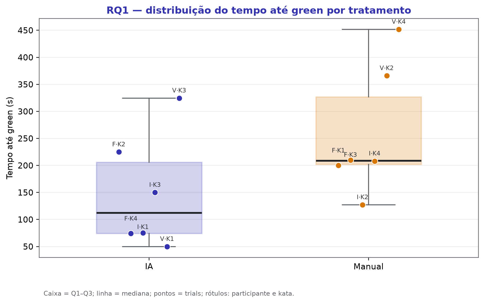
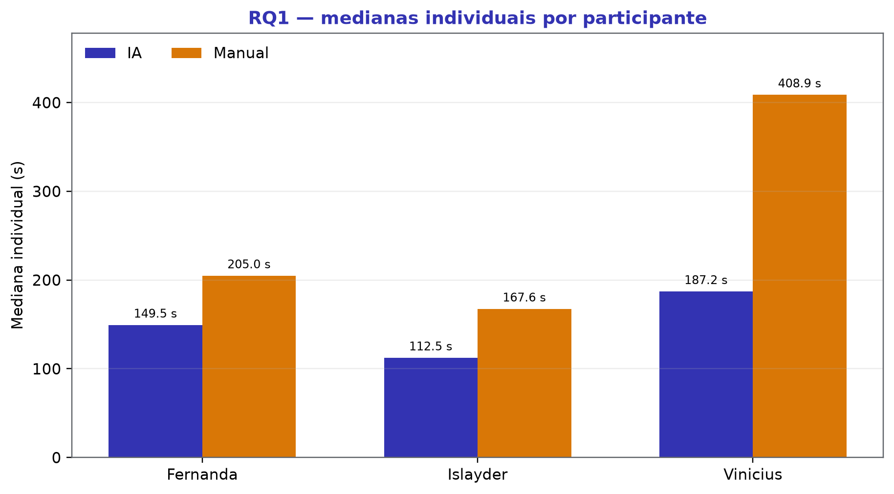
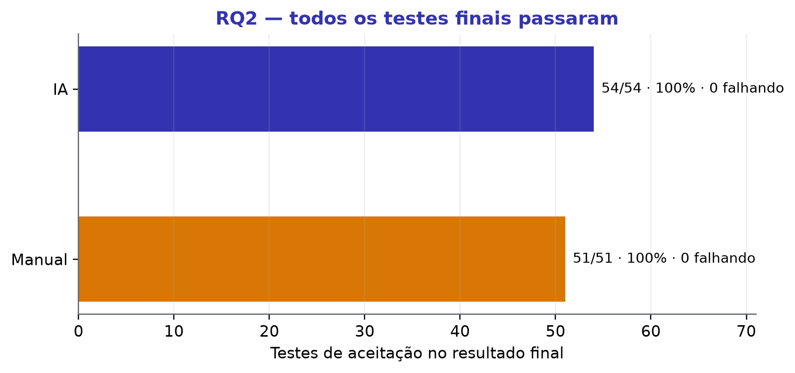
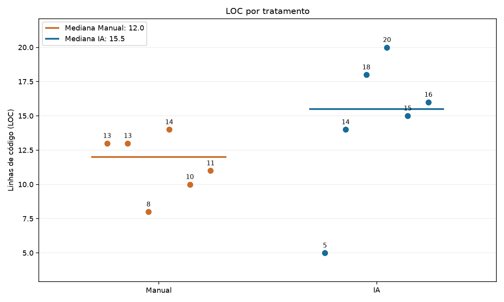
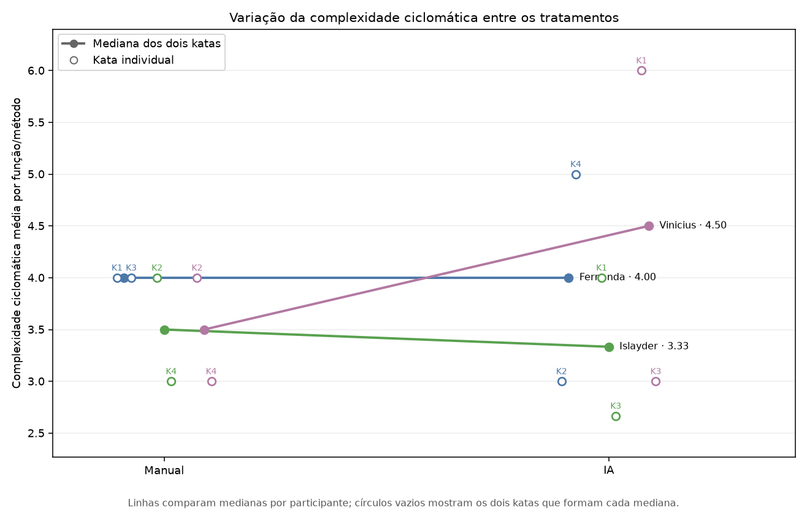
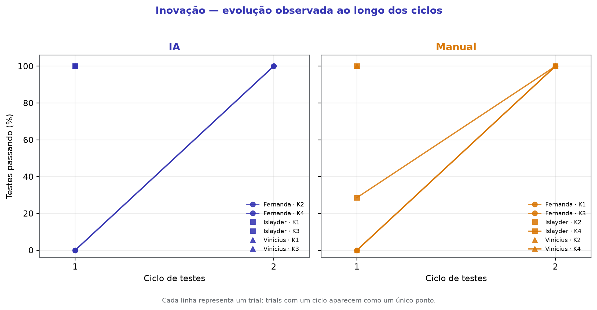
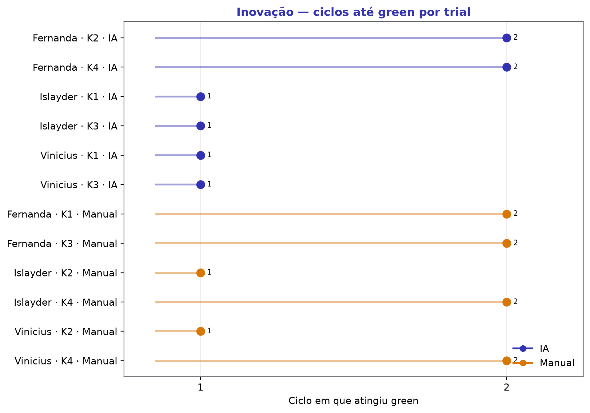
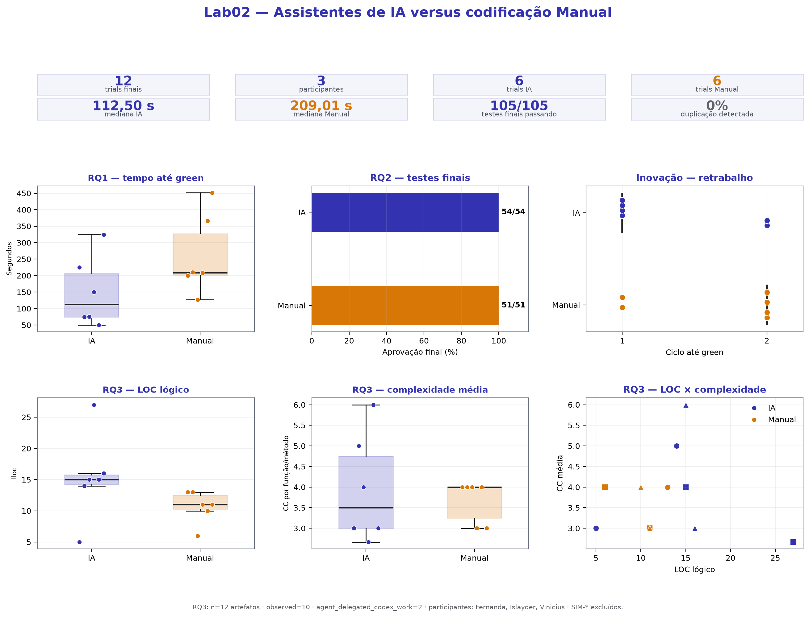

# Laboratório 02 — Assistentes de IA vs. Codificação Manual

## 1. Introdução

Assistentes de inteligência artificial passaram a integrar o fluxo cotidiano de desenvolvimento de software, mas seus efeitos sobre produtividade, correção e estrutura do código dependem do contexto e da tarefa. Este laboratório compara a resolução de quatro katas em Python com assistência de IA e por codificação manual, usando um protocolo comum, testes de aceitação e métricas reproduzíveis.

O estudo foi orientado pelas seguintes questões:

- **RQ1 — Tempo:** o uso de assistente de IA altera o tempo necessário para atingir uma solução com todos os testes aprovados?
- **RQ2 — Testes:** o tratamento altera o resultado final dos testes de aceitação?
- **RQ3 — Estrutura:** o tratamento altera LOC, complexidade ciclomática ou duplicação do código produzido?
- **Inovação:** como os testes evoluem entre os ciclos e quanto retrabalho ocorre até o estado verde?

Antes da análise, o grupo considerou como hipótese que a IA reduziria o tempo e o número de ciclos, sem necessariamente produzir diferença no resultado final dos testes. Para RQ3, a hipótese foi exploratória, pois códigos mais extensos podem apresentar tanto maior clareza quanto complexidade desnecessária. A contribuição adicional do grupo foi registrar a evolução dos testes por ciclo, permitindo analisar o processo até a solução final, e não somente o último resultado.

## 2. Contexto

O Laboratório 02 foi realizado por Fernanda Soares, Islayder Jackson e Vinicius Gomes na disciplina Laboratório de Experimentação de Software, do curso de Engenharia de Software da PUC Minas. O trabalho foi organizado em três sprints, com protocolo, instrumentação, execução dos trials, análise estatística, avaliação estrutural e consolidação dos resultados.

Cada participante resolveu quatro katas: dois com IA e dois manualmente. O desenho de medidas repetidas permitiu que todos vivenciassem os dois tratamentos. Os katas envolveram normalização de etiquetas, balanceamento de turnos, compactação de leituras de sensor e priorização de manutenção preditiva. As tarefas foram implementadas como funções puras em Python e avaliadas por testes de aceitação previamente definidos.

O conjunto final reúne 12 trials válidos, quatro por participante e seis por tratamento. Todos terminaram com estado `green`. As comparações são apresentadas como evidência descritiva de uma amostra pequena; por isso, não devem ser generalizadas para outros desenvolvedores, tarefas ou ferramentas sem novos estudos.

## 3. Metodologia

Foi adotado um experimento intrassujeitos com dois tratamentos: **IA** e **Manual**. Cada trial começou no código-base do kata e terminou quando todos os testes passaram ou quando o limite de 35 minutos foi atingido. O protocolo registrou tempo até `green`, resultado dos testes, número de ciclos e código final.

Islayder e Vinicius executaram Kata 1 e Kata 3 com IA, e Kata 2 e Kata 4 manualmente. Fernanda realizou a alocação complementar: Kata 1 e Kata 3 manualmente, e Kata 2 e Kata 4 com IA. Assim, cada participante executou dois trials por tratamento e todos os katas apareceram nos dois tratamentos no conjunto do grupo.

Para RQ1, as medianas individuais de tempo em IA e Manual foram pareadas por participante e comparadas pelo teste de Wilcoxon. Para RQ2, foram analisadas as contagens finais de testes aprovados e reprovados. Para RQ3, o código final foi medido quanto a linhas lógicas, complexidade ciclomática e duplicação. Na inovação, cada execução da suíte foi tratada como um ciclo até `green`.

### 3.1 Principais Desafios

Os principais desafios técnicos e metodológicos foram:

- manter o mesmo limite temporal e os mesmos critérios de encerramento em todos os trials;
- contrabalancear os tratamentos com três participantes e quatro katas;
- consolidar os resultados preservando a identidade de participante, kata, tratamento e Issue;
- separar dados finais de ensaios preparatórios, evitando ampliar artificialmente a amostra;
- relacionar cada medida estrutural ao respectivo artefato de código;
- interpretar estatísticas com apenas três participantes, sem transformar diferenças descritivas em conclusões causais.

Esses desafios foram tratados com validações automáticas dos arquivos consolidados, conferência dos testes de aceitação, seleção explícita dos 12 trials finais e apresentação dos pontos individuais nos gráficos.

### 3.2 Tomadas de Decisão

O time-box foi fixado em 2.100 segundos para manter comparabilidade e impedir que um único trial consumisse tempo indefinido. O estado `green` foi definido como aprovação integral da suíte do kata. As análises usam contagens absolutas juntamente com percentuais, pois 100% pode representar totais diferentes entre tarefas.

O grupo optou por medianas e intervalos interquartis como medidas principais devido à amostra pequena e à dispersão dos tempos. O Wilcoxon foi aplicado às medianas individuais, resultando em apenas três pares; seu valor-p é apresentado com essa limitação explícita. Para código, LOC, complexidade e duplicação foram mantidas como dimensões separadas, sem criar um índice único de qualidade.

O limite de trabalho em andamento foi definido em **três itens na coluna Doing**, no máximo um por integrante. Essa regra favoreceu responsabilidade clara, revisão pelos colegas e fluxo contínuo sem concentrar várias atividades simultâneas em uma pessoa.

### 3.3 Etapas

| Etapa | Entregas principais | Responsáveis | Issues |
|---|---|---|---|
| Lab02S01 | Protocolo, katas, testes, instrumentação e métricas estruturais | Grupo | #14, #15 e #17 |
| Lab02S02 | Execução dos 12 trials e consolidação dos artefatos | Fernanda, Islayder e Vinicius | #19 a #32 |
| Lab02S03 | RQ1, RQ2, inovação, RQ3 e dashboard | Islayder, Fernanda e Vinicius | #33, #34 e #35 |
| Relatório final | Síntese metodológica, resultados, discussão e revisão | Grupo | #33 |

As responsabilidades foram distribuídas por frente: Islayder consolidou RQ1, RQ2 e a análise de ciclos; Fernanda trabalhou na avaliação estrutural de RQ3; Vinicius produziu o dashboard; e o relatório integrou os resultados do grupo.

### 3.4 Ferramentas

- **Python e pytest:** implementação dos katas e execução dos testes de aceitação.
- **Pandas:** consolidação dos trials e estatísticas descritivas.
- **SciPy:** teste pareado de Wilcoxon.
- **Matplotlib e Seaborn:** gráficos das questões de pesquisa e da inovação.
- **Radon 6.0.1:** LOC lógico e complexidade ciclomática.
- **jscpd 5.2.0:** detecção de linhas e blocos duplicados.
- **Git e GitHub Projects:** versionamento, Issues, rastreabilidade e acompanhamento do trabalho.
- **python-docx:** geração do relatório no modelo institucional.

### 3.5 Tabela de Métricas

| RQ | Métrica | Definição operacional | Unidade | Ferramenta / Fonte |
|---|---|---|---|---|
| RQ1 | Tempo até green | Segundos do início do trial até todos os testes passarem; limite de 2.100 s | segundos | Registros dos trials |
| RQ2 | Testes finais | Quantidade aprovada, reprovada e total no encerramento | testes e percentual | pytest e testes de aceitação |
| RQ3 | LOC lógico | Linhas lógicas de `solucao.py` | linhas | Radon 6.0.1 |
| RQ3 | Complexidade | Média e máximo da complexidade ciclomática por arquivo | pontos de CC | Radon 6.0.1 |
| RQ3 | Duplicação | Proporção, linhas e blocos duplicados | percentual e contagem | jscpd 5.2.0 |
| Inovação | Ciclos até green | Número de execuções da suíte até aprovação integral | ciclos | Histórico dos trials |

### 3.6 Inovações Propostas pelo Grupo (30% da nota)

A inovação consistiu em acompanhar a evolução dos testes ao longo dos ciclos. Em vez de registrar somente o resultado final, o protocolo preservou quantos testes passavam em cada execução e em qual ciclo ocorreu o primeiro `green`. Isso permitiu observar retrabalho, velocidade de convergência e diferenças de trajetória entre os tratamentos.

Também foi implementado um dashboard consolidado com KPIs e distribuições de tempo, testes, ciclos, LOC e complexidade. O painel reúne as principais evidências sem substituir os dados individuais e pode ser regenerado a partir dos arquivos versionados.

## 4. Resultados

### 4.1 Coleta de Dados

O conjunto analisado contém 12 trials finais: quatro de cada participante, sendo seis com IA e seis manuais. Não houve trial censurado pelo time-box, e todos alcançaram `green`. Para RQ3, foram analisados 12 artefatos de código, um para cada combinação final de participante e kata.

| Participante | Issue | Kata | Tratamento | Tempo (s) | Testes | Ciclos | Status |
|---|---|---|---|---:|---:|---:|---|
| Fernanda | #19 | Kata 2 | IA | 224,89 | 9/9 | 2 | green |
| Fernanda | #27 | Kata 1 | Manual | 200,00 | 10/10 | 2 | green |
| Fernanda | #29 | Kata 4 | IA | 74,02 | 7/7 | 2 | green |
| Fernanda | #28 | Kata 3 | Manual | 210,00 | 9/9 | 2 | green |
| Islayder | #21 | Kata 1 | IA | 75,00 | 10/10 | 1 | green |
| Islayder | #24 | Kata 2 | Manual | 127,17 | 9/9 | 1 | green |
| Islayder | #25 | Kata 3 | IA | 150,00 | 9/9 | 1 | green |
| Islayder | #26 | Kata 4 | Manual | 208,02 | 7/7 | 2 | green |
| Vinicius | #22 | Kata 1 | IA | 49,95 | 10/10 | 1 | green |
| Vinicius | #30 | Kata 2 | Manual | 365,99 | 9/9 | 1 | green |
| Vinicius | #31 | Kata 3 | IA | 324,52 | 9/9 | 1 | green |
| Vinicius | #32 | Kata 4 | Manual | 451,74 | 7/7 | 2 | green |

### 4.2 Visualização Gráfica

#### RQ1 — O uso de IA altera o tempo até green?

| Tratamento | n | Média (s) | Mediana (s) | Q1 (s) | Q3 (s) | IQR (s) |
|---|---:|---:|---:|---:|---:|---:|
| IA | 6 | 149,73 | 112,50 | 74,265 | 206,168 | 131,903 |
| Manual | 6 | 260,487 | 209,010 | 202,005 | 326,993 | 124,988 |

*Figura 1 — Distribuição do tempo até green. Os pontos representam os 12 trials.*

A mediana foi de 112,50 s com IA e 209,010 s no tratamento Manual. O Wilcoxon pareado pelas medianas individuais resultou em **W = 0,0** e **p = 0,25**. A diferença observada é descritiva e não constitui evidência estatística suficiente de efeito do tratamento.

*Figura 2 — Medianas individuais usadas no pareamento por participante.*

#### RQ2 — O tratamento altera o resultado dos testes?

| Tratamento | Trials | Green | Testes passando | Falhando | Total | Taxa final |
|---|---:|---:|---:|---:|---:|---:|
| IA | 6 | 6 | 54 | 0 | 54 | 100% |
| Manual | 6 | 6 | 51 | 0 | 51 | 100% |

*Figura 3 — Resultado agregado dos testes finais por tratamento.*

Todos os 105 testes finais passaram. Logo, RQ2 não apresentou diferença no desfecho final de aceitação: IA alcançou 54/54 e Manual alcançou 51/51, ambos sem falhas.

#### RQ3 — O tratamento altera a estrutura do código?

| Tratamento | LOC mediana | LOC IQR | CC média mediana | CC IQR | Duplicação mediana |
|---|---:|---:|---:|---:|---:|
| IA | 15,0 | 1,50 | 3,5 | 1,75 | 0% |
| Manual | 11,0 | 2,25 | 4,0 | 0,75 | 0% |

*Figura 4 — LOC lógico dos 12 artefatos finais.*

*Figura 5 — Complexidade ciclomática média dos artefatos finais.*

IA apresentou maior mediana de LOC e menor mediana de complexidade média. A duplicação foi 0% em todos os artefatos. Como os tratamentos envolvem katas distintos e há somente seis arquivos por grupo, os resultados são descritivos.

#### Inovação — Como os testes evoluem até green?

| Tratamento | Trials | Mediana de ciclos | Intervalo | Taxa mediana no 1º ciclo | Taxa final |
|---|---:|---:|---:|---:|---:|
| IA | 6 | 1 | 1–2 | 100% | 100% |
| Manual | 6 | 2 | 1–2 | 14,285% | 100% |

*Figura 6 — Evolução dos testes ao longo dos ciclos registrados.*

*Figura 7 — Quantidade de ciclos necessária para atingir green.*

A IA atingiu `green` em mediana de um ciclo, enquanto o tratamento Manual precisou de dois. Os dois grupos chegaram a 100% no encerramento.

*Figura 8 — Dashboard final das questões de pesquisa e da inovação.*

### 4.3 Discussão

A hipótese de menor tempo com IA foi parcialmente apoiada pela descrição dos dados: média e mediana foram menores nesse tratamento, e os três participantes apresentaram mediana individual menor com IA. Entretanto, o teste pareado não detectou diferença estatística. Assim, RQ1 sugere uma possível vantagem temporal nesta amostra, mas não permite afirmar causalidade.

Na RQ2, a hipótese de equivalência no resultado final foi confirmada: os dois tratamentos terminaram com 100% dos testes passando. A análise de inovação acrescentou uma diferença de processo, pois IA apresentou menor número mediano de ciclos e maior taxa de aprovação no primeiro ciclo.

Na RQ3, os códigos com IA foram mais extensos na mediana, ligeiramente menos complexos pela média ciclomática e igualmente sem duplicação. Esses indicadores representam dimensões diferentes e não justificam classificar um tratamento como globalmente superior.

As principais ameaças à validade são o número reduzido de participantes, a diferença de dificuldade entre katas, efeitos de aprendizado e fadiga, variações de ambiente e ferramenta, e o baixo poder do Wilcoxon com três pares. LOC, complexidade e duplicação também não cobrem legibilidade, arquitetura, segurança ou facilidade de manutenção. Os resultados devem, portanto, ser interpretados como evidência local e exploratória.

## 5. Conclusão

O Laboratório 02 comparou seis trials com IA e seis manuais, totalizando 12 execuções e 12 artefatos estruturais. Em RQ1, IA apresentou mediana de 112,50 s, contra 209,010 s em Manual, mas sem diferença estatisticamente detectável. Em RQ2, os dois tratamentos concluíram todos os testes com sucesso.

Em RQ3, IA apresentou LOC mediana de 15, complexidade média mediana de 3,5 e duplicação de 0%; Manual apresentou LOC mediana de 11, complexidade média mediana de 4,0 e duplicação de 0%. Na inovação, IA chegou a `green` em mediana de um ciclo, contra dois ciclos no tratamento Manual.

Os resultados apontam diferenças de tempo, trajetória e estrutura, mas não sustentam uma conclusão geral de superioridade. A principal contribuição do trabalho foi integrar medidas de resultado e de processo em um fluxo rastreável e reproduzível. Estudos futuros devem ampliar o número de participantes, controlar melhor a dificuldade dos katas e repetir o protocolo com outras ferramentas e tarefas.

## 6. Referências

- ZUSE, Horst. *A framework of software measurement*. Walter de Gruyter, 2013.
- Documentação do Python 3 e do pytest.
- Documentação do SciPy para o teste de Wilcoxon.
- Documentação do Radon 6.0.1.
- Documentação do jscpd 5.2.0.
- Artefatos, scripts de análise e registros experimentais do repositório do Laboratório 02.
